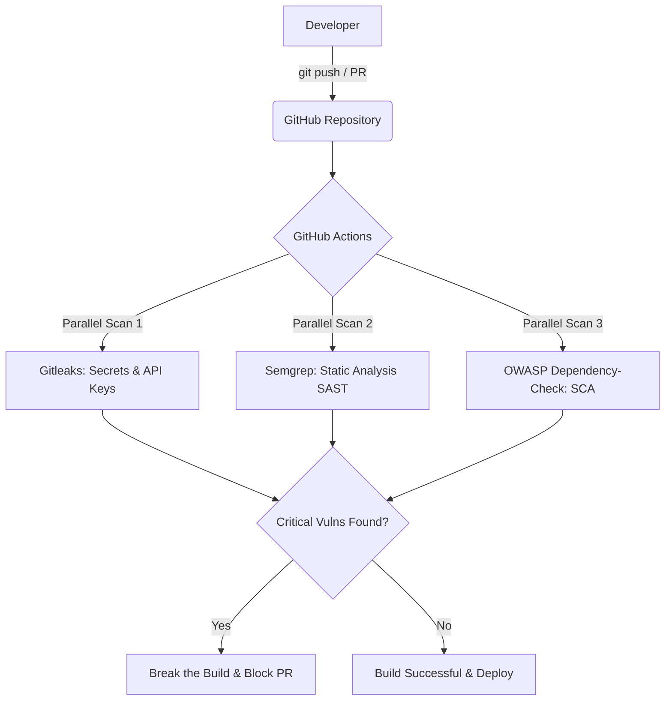

# Secure React Pipeline

A fully automated security pipeline for React applications, integrated directly into GitHub Actions.

This project showcases how to embed automated security checks (SAST, SCA, and Secrets Detection) into a React development workflow to catch vulnerabilities before they reach production.

## Live Deployments

* **Development Environment (Continuous Deployment):** [https://secure-react-pipeline-dev.vercel.app](https://secure-react-pipeline-dev.vercel.app)
* **Production Environment (Manual Trigger):** [https://dorismond.fr](https://dorismond.fr) (also accessible at [https://samuel.dorismond.fr](https://samuel.dorismond.fr))

---

## Architecture and Workflow

Here is how the security checks are integrated into the development lifecycle:



---

## Integrated Security Tools

Every push and pull request automatically triggers the following scans:

| Scanner | Category | What it checks | Scope |
|---|---|---|---|
| **Semgrep** | **SAST** (Static Application Security Testing) | Vulnerability patterns in JS/TS (XSS, insecure DOM insertion, bad configurations) | React codebase |
| **OWASP Dependency-Check** | **SCA** (Software Composition Analysis) | Outdated or insecure packages and known CVEs in npm dependencies | `package.json` & `package-lock.json` |
| **Gitleaks** | **Secrets Detection** | Hardcoded API keys, private keys, database credentials, and tokens | Full git history & commit diffs |

---

## Key DevSecOps Features

### Break the Build Policy
Security is only effective if it prevents bad code from shipping. This pipeline is configured with strict quality gates:
* **Gitleaks**: Exits with a non-zero code immediately if any exposed secret is detected.
* **Semgrep**: Fails the run if rules in the `Error` category (e.g. CSRF flaws, DOM-XSS) are triggered.
* **SCA**: Flags builds containing high- or critical-severity CVEs.

### Performance and Caching Optimizations
Slow pipelines frustrate developers. This pipeline is optimized for speed:
* **Database Caching**: The OWASP Dependency-Check CVE database is cached across runs using GitHub Actions cache, reducing scan times from 10 minutes to under 2 minutes.
* **Incremental Scanning**: Gitleaks only scans the commit range of the Pull Request, preventing slow scans on larger repositories.

### Shift Left (Local Git Hooks)
Catch security issues before they reach the remote repository:
* Uses **Husky** and **lint-staged** to run Gitleaks locally on staged files prior to commit.

---

## Real-world Findings and Remediation

Below are real findings detected and remediated using this pipeline on a test React application:

| Tool | Finding | Severity | Real-world Impact | Remediation |
| :--- | :--- | :---: | :--- | :--- |
| **Gitleaks** | Hardcoded Stripe API Key | **Critical** | Potential financial exposure and unauthorized backend access | Revoked key, moved credentials to GitHub Actions Secrets or Environment Variables |
| **Semgrep** | Insecure use of `dangerouslySetInnerHTML` | **High** | Cross-Site Scripting (XSS) via user input injection | Replaced with safe JSX rendering or sanitized using `dompurify` |
| **OWASP SCA** | `axios < 1.6.0` (CVE-2023-45857) | **High** | SSRF (Server-Side Request Forgery) vulnerability | Ran `npm install axios@latest` to upgrade to a patched version |

---

## How to Set Up

### 1. Copy the Configuration
Copy the workflow configuration file into your project:
```bash
cp .github/workflows/security.yml your-project/.github/workflows/
```

### 2. Configure GitHub Secrets
Add any necessary tokens or environment variables to **Settings > Secrets and variables > Actions** in your repository.

---

Built by [Samuel Dorismond](https://www.dorismond.fr) — Freelance DevSecOps Engineer & Security Consultant
