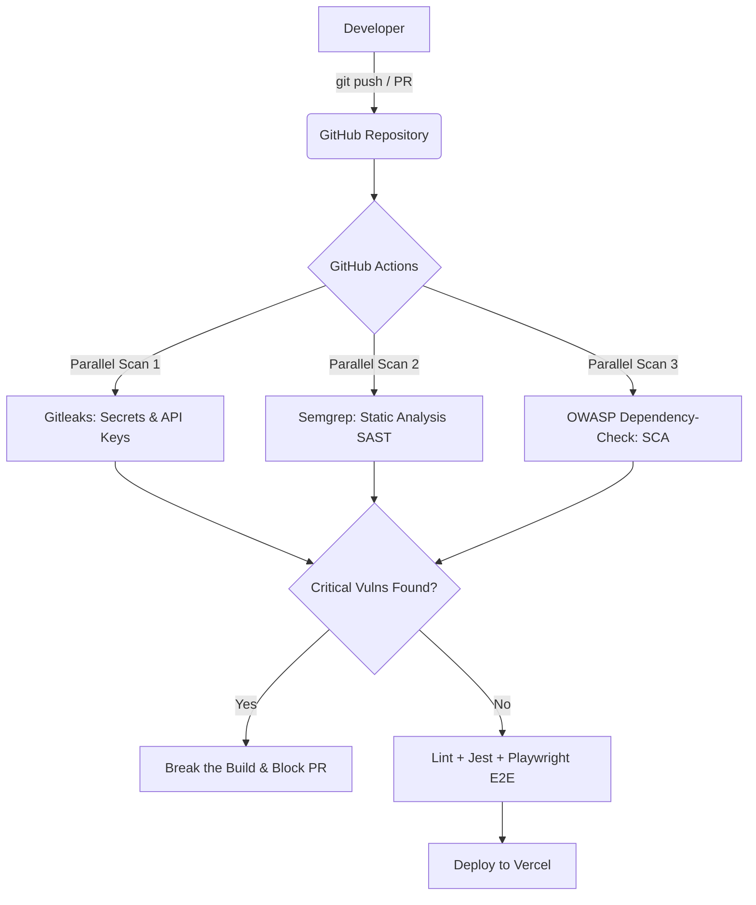

# Secure React Pipeline

Personal portfolio of **Samuel Dorismond** ([dorismond.fr](https://dorismond.fr)) — a bilingual **Next.js** website shipped through a fully automated **DevSecOps pipeline** on GitHub Actions.

This project has two faces: a modern, SEO-optimized portfolio (the product), and a security-first CI/CD pipeline (the engineering showcase) that embeds automated security checks — SAST, SCA, and Secrets Detection — into the development workflow to catch vulnerabilities before they reach production.

## Live Deployments

* **Development (Continuous Deployment):** [https://secure-react-pipeline-dev.vercel.app](https://secure-react-pipeline-dev.vercel.app)
* **Production (Manual Trigger):** [https://dorismond.fr](https://dorismond.fr) (also at [https://samuel.dorismond.fr](https://samuel.dorismond.fr))

---

## The Website

- **Framework:** Next.js 15 (App Router, JavaScript/JSX) — server rendering + static generation for excellent SEO
- **i18n:** bilingual FR/EN with locale routing (`/fr`, `/en`) via `next-intl`, `hreflang` and per-page canonicals
- **Styling:** Tailwind CSS, dark/light theme (`next-themes`), animated "tech" particle background
- **Content as files (no backend):** everything lives in `content/` — edit a file + `git push` to update the site
- **SEO:** metadata & Open Graph per page, `sitemap.xml`, `robots.txt`, JSON-LD (Person / CreativeWork)
- **Images:** optimized to WebP via `next/image`
- **Analytics:** `@vercel/analytics`

### Run locally

```bash
npm install
npm run dev        # http://localhost:3000
```

Other commands: `npm run build`, `npm run start`, `npm run lint`, `npm test` (Jest), `npm run test:e2e` (Playwright).

### Update content (no code)

- **Personal info** (bio, experience, education, skills): edit [`content/profile.json`](content/profile.json). Text fields are bilingual: `{ "fr": "…", "en": "…" }`.
- **Add a project:** create `content/projects/<slug>.json` (copy an existing one). Fields: `slug`, `category` (`web` · `cyber` · `ai` · `devops` · `software` · `web3` · `games` · `academic`), `order`, `featured`, `date`, `title`, `description` (bilingual), `tags`, `softSkills` (bilingual), `link`, `cover`, `images`.
- **Remove a project:** delete its JSON file. A project without a `cover` shows a stylized "code" card.
- **UI strings:** [`content/i18n/fr.json`](content/i18n/fr.json) and [`content/i18n/en.json`](content/i18n/en.json).

---

## Architecture and Workflow

Here is how the security checks are integrated into the development lifecycle:



The pipeline ([`.github/workflows/security-pipeline.yml`](.github/workflows/security-pipeline.yml)) runs, on every push and pull request: security scans → lint + unit tests (Jest) → end-to-end tests (Playwright) → deploy to the **development** Vercel project. Deployment to **production** (dorismond.fr) is a manual `workflow_dispatch` trigger.

---

## Integrated Security Tools

Every push and pull request automatically triggers the following scans:

| Scanner | Category | What it checks | Scope |
|---|---|---|---|
| **Semgrep** | **SAST** (Static Application Security Testing) | Vulnerability patterns in JS/TS (XSS, insecure DOM insertion, bad configurations) | React/Next.js codebase |
| **OWASP Dependency-Check** | **SCA** (Software Composition Analysis) | Outdated or insecure packages and known CVEs in npm dependencies | `package.json` & `package-lock.json` |
| **Gitleaks** | **Secrets Detection** | Hardcoded API keys, private keys, database credentials, and tokens | Full git history & commit diffs |

---

## Key DevSecOps Features

### Break the Build Policy
Security is only effective if it prevents bad code from shipping. This pipeline is configured with strict quality gates:
* **Gitleaks**: Exits with a non-zero code immediately if any exposed secret is detected.
* **Semgrep**: Fails the run if rules in the `Error` category (e.g. CSRF flaws, DOM-XSS) are triggered.
* **SCA**: Flags builds containing high- or critical-severity CVEs.

### Quality Gates Before Deploy
Deployment is gated behind **lint**, **Jest unit tests** and **Playwright end-to-end tests** — a build only ships if every gate is green.

### Performance and Caching Optimizations
* **Incremental Scanning**: Gitleaks only scans the commit range of the Pull Request, preventing slow scans on larger repositories.
* **Dependency caching**: npm caching across runs speeds up installs.

---

## Real-world Findings and Remediation

Below are real findings detected and remediated using this pipeline:

| Tool | Finding | Severity | Real-world Impact | Remediation |
| :--- | :--- | :---: | :--- | :--- |
| **Gitleaks** | Hardcoded Stripe API Key | **Critical** | Potential financial exposure and unauthorized backend access | Revoked key, moved credentials to GitHub Actions Secrets or Environment Variables |
| **Semgrep** | Insecure use of `dangerouslySetInnerHTML` | **High** | Cross-Site Scripting (XSS) via user input injection | Replaced with safe JSX rendering or sanitized using `dompurify` |
| **OWASP SCA** | `axios < 1.6.0` (CVE-2023-45857) | **High** | SSRF (Server-Side Request Forgery) vulnerability | Ran `npm install axios@latest` to upgrade to a patched version |

---

## How to Set Up

### 1. Secrets
Add the required tokens under **Settings > Secrets and variables > Actions**: `VERCEL_TOKEN`, `VERCEL_ORG_ID`, `VERCEL_PROJECT_ID_DEV`, `VERCEL_PROJECT_ID_PROD`.

### 2. Vercel
Ensure the Vercel projects have their **Framework Preset** set to **Next.js**.

---

Built by [Samuel Dorismond](https://www.dorismond.fr) — Engineering student at EPITA & Cybersecurity Engineering apprentice at Cyber Test Systems.
